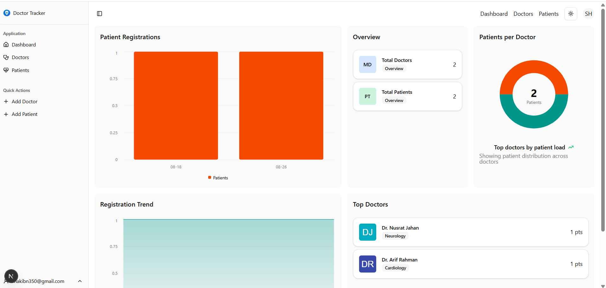
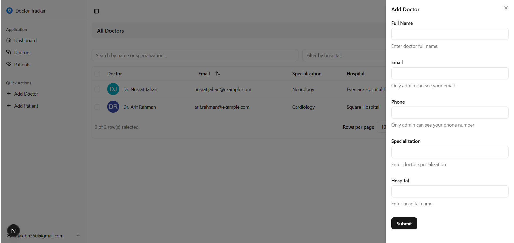
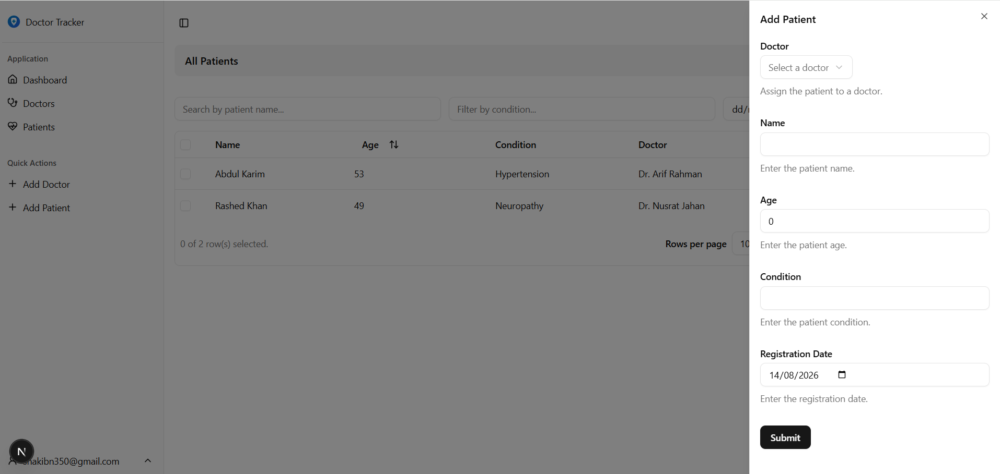
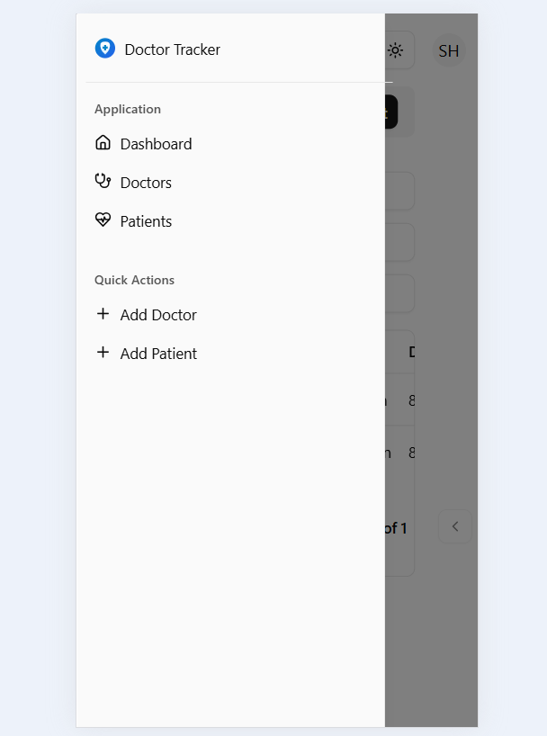
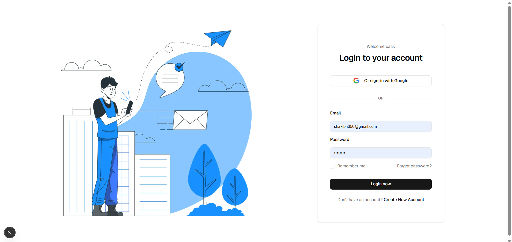

# 👨‍⚕️ Care-Guide BD — Doctor Tracker Frontend

A modern, responsive, and performance-optimized Admin Dashboard for managing doctors, patients, and healthcare analytics. Built with **Next.js 15 (App Router), TypeScript, Redux Toolkit (RTK Query), NextAuth.js, and Tailwind CSS**.

---

## 🚀 Description

**Care-Guide BD / Doctor Tracker** is a production-grade healthcare management application designed to streamline doctor-patient administration. It provides healthcare administrators with a secure login portal, a real-time statistical dashboard with interactive charts, instant searching and filtering capabilities across doctors and patients, and seamless modal operations — all powered by a decoupled Express/MongoDB backend service.

---

## 🛠️ Tech Stack & Architecture

| Technology           | Purpose                                                             |
| :------------------- | :------------------------------------------------------------------ |
| **Framework**        | Next.js 15 (App Router with Hybrid SSR/CSR Strategy)                |
| **Language**         | TypeScript (Strict Data Contracts & Interfaces)                     |
| **State Management** | Redux Toolkit & RTK Query (Caching, Refetching, & Tag Invalidation) |
| **Authentication**   | NextAuth.js (Session Management & JWT Token Handling)               |
| **Styling**          | Tailwind CSS & Shadcn UI Components                                 |
| **Icons & Charts**   | Lucide React, Recharts (Area, Bar, & Pie Charts)                    |
| **HTTP Client**      | Axios & RTK Query Base Fetch                                        |

---

## ⚙️ Setup & Installation Guide

Follow these steps to run the frontend application locally:

### 1. Clone the Repository

```bash
git clone <your-frontend-repository-url>
cd docker-tracker-frontend
```

### 2. Install Dependencies

```bash
pnpm install
# or
npm install
```

### 3. Configure Environment Variables

Create a `.env` file in the root directory of `docker-tracker-frontend`:

```
NEXT_PUBLIC_API_URL=http://localhost:5000/api/v1
NEXTAUTH_SECRET=your_super_secret_nextauth_key
NEXTAUTH_URL=http://localhost:3000
```

> **Note:** Make sure to commit `.env.example` to GitHub, but never commit your real `.env` file.

### 4. Run Development Server

```bash
pnpm dev
# or
npm run dev
```

Open [http://localhost:3000](http://localhost:3000) in your browser to view the application.

---

## 🏗️ System Architecture & Data Flow

The frontend follows a clean modular architecture separating NextAuth authentication, Redux state management, custom UI providers, and page layouts:

```
src/
├── app/                      # Next.js App Router Pages
│   ├── (auth)/               # Login & Registration Pages
│   └── (dashboard)/          # Protected Dashboard, Doctors, & Patients Views
├── components/               # Reusable UI, Modals, Tables, Charts, & Sidebar
│   ├── providers/            # Theme, Alert, and NextAuth Session Providers
│   └── ui/                   # Modular UI Primitives (Button, Sheet, Input)
├── features/auth/            # Auth API Configs & Session Options
├── hooks/                    # Custom React Hooks (useAuth, useMobile)
├── lib/                      # Axios Instance & Common Utilities
├── redux/                    # Redux Store & RTK Query Slices
│   ├── api/                  # baseApi, doctorApi, patientApi, statsApi
│   └── store.ts              # Global Redux Store Configuration
├── types/                    # TypeScript Data Contracts (Doctor, Patient, Auth)
└── utils/                    # Helper Functions & Error Parsers
```

### High-Level Data Flow Architecture

```
Client Action (UI)
     │
     ▼
RTK Query Hook / NextAuth Hook
     │
     ▼
JWT Token Injection (via NextAuth Session)
     │
     ▼
Express Backend API (http://localhost:5000/api/v1)
     │
     ▼
Automatic RTK Query Cache Update / Tag Invalidation
     │
     ▼
Instant UI Re-render
```

---

## 🧠 Technical Decisions (Deep Dive)

### 1. Redux Toolkit (RTK Query) vs. Context API / Custom Fetch

**Why We Chose RTK Query:** Rather than manually managing global state with standard React Context or `useEffect` fetch loops, RTK Query provides automated endpoint-based caching, de-duplication of requests, loading/error states, and optimistic UI updates.

**Tag Invalidation:** Operations like `deletePatientFromDoctor` or `addDoctor` instantly trigger RTK Query tag invalidations (`Doctor` and `Patient` tags), causing dependent tables to automatically refetch and update without forcing page reloads.

### 2. Next.js App Router Hybrid Rendering (SSR vs. CSR)

**Server-Side Rendering (SSR):** Root layouts (`layout.tsx`), layout wrappers, and static container structures are kept as Server Components. This ensures rapid initial HTML payload delivery, optimal CSS hydration, and layout persistence across page navigation.

**Client-Side Rendering (CSR):** Interactive features — such as live statistical charts (`AppAreaChart`, `AppPieChart`), search & filter data tables (`DataTable`), and slide-over forms (`AddDoctor`, `EditPatient`) — use the `'use client'` directive to seamlessly handle client-side user interactions and dynamic RTK Query hooks.

---

## 📸 Visual Evidence (UI Screenshots)

| Overview                  | Feature                        | Screenshot                                            |
| :------------------------ | :----------------------------- | :---------------------------------------------------- |
| **Dashboard**             | Analytics Charts & Quick Stats |       |
| **Doctor Management**     | Live Data Table & Search       |      |
| **Doctor's Patients**     | Assigned Patients & Actions    |  |
| **Mobile Responsiveness** | Drawer & Mobile Navigation     |        |
| **Authentication**        | Login & Registration UI        |          |

---

## 📜 Available Scripts

```bash
# Start development server
pnpm dev

# Build for production
pnpm build

# Start production server
pnpm start

# Run linter
pnpm lint
```

---

## 👨‍💻 Author

**Care-Guide BD Frontend**

Built with Next.js 15, Redux Toolkit, Tailwind CSS, and TypeScript.
